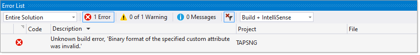
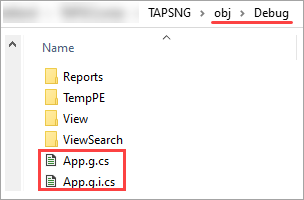

# error MC1000: Unknown build error

All work has to be done in VS2017 as the setup projects are not supported in VS2019 and saw no good reason to spend time on this like removing setup projects and work with views and code.

Task, take 30 views in a WPF project and make each view read-only. All that was touched through the process was editing XAML and a bit of C# code for inputs with bindings set for IsEnabled.


After working on 95 percent of the views, on a build received that following ambiguous message.



Which points to 

> C:\WINDOWS\Microsoft.NET\Framework\v4.0.30319\Microsoft.WinFx.targets

This just did not sit right with me so I cloned the solution from the last known good working version.

Thinking this was not something to do with work done on views I next started going through App.xaml which seemed like there was something odd, no Main method which was expected as per below.

```csharp
[System.STAThreadAttribute()]
[System.Diagnostics.DebuggerNonUserCodeAttribute()]
[System.CodeDom.Compiler.GeneratedCodeAttribute("PresentationBuildTasks", "4.0.0.0")]
public static void Main() {
    SplashScreen splashScreen = new SplashScreen("resources/tapsspalshscreen.png");
    splashScreen.Show(true);
    TAPSNG.App app = new TAPSNG.App();
    app.InitializeComponent();
    app.Run();
}
```
**Where is Main?**




Note you can not simply copy the above and make it good to go nor attempting to create Main via right clicking on App.xaml.

What to do? Open a clone of the project, in Windows Explorer dumped that work I did into the clone and it works now.

Why did this happen, not a clue.

**What can be learned from this?**

First and foremost, learn to work with source control along with never committing code which will not build and secondly, in a situation like this after search in Google for no more than two minutes know that you most likely are on your own. Not a pleasant thought if no to coding and this will come with experience.

